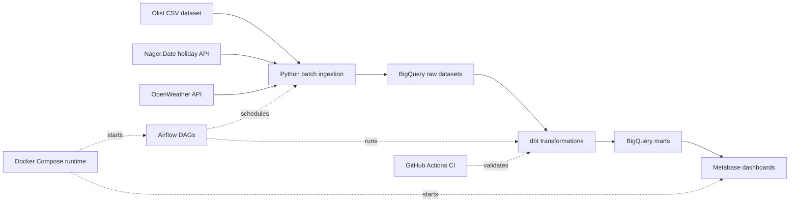

# MerchantPulse: Marketplace Revenue & Fulfillment Analytics Platform

MerchantPulse is a production-style data engineering and analytics engineering
project for a marketplace business. It shows how transactional and enrichment
data can be loaded into BigQuery, modeled with dbt, checked with data quality
rules, and served to executive and operations dashboards.

This repository is currently in the foundation stage. The target architecture is
defined, the dbt project is initialized, and the documentation now separates
what exists today from what will be built next.

## Business Problem

Marketplace teams often have order, seller, payment, delivery, and review data
spread across different systems. Executives need reliable revenue and customer
experience metrics. Operations teams need seller and fulfillment signals. Data
teams need one governed place where metric logic, table grains, tests, and
lineage are easy to inspect.

MerchantPulse turns that problem into an end-to-end platform:

```text
business questions -> ingestion -> warehouse modeling -> data quality
-> metrics -> dashboards -> reproducible delivery
```

## Current Build Status

| Area | Status | Evidence |
|---|---|---|
| Project charter and architecture | In progress | `README.md`, `docs/architecture.md` |
| Local Python dependency set | Started | `requirements.in`, `requirements.txt` |
| BigQuery configuration template | Started | `.env.example` |
| BigQuery connection smoke test | Started | `tests/test_bigquery_connection.py` |
| dbt project initialization | Started | `marketplace_analytics_dbt/dbt_project.yml` |
| Ingestion loaders | Planned | `ingestion/` folder exists; modules not implemented yet |
| dbt staging, intermediate, and marts | Implemented | `marketplace_analytics_dbt/models/` contains staging, intermediate, facts, dimensions, and marts |
| Airflow orchestration | Planned | `airflow/dags/` folder exists; DAGs not implemented yet |
| Metabase dashboards | Planned | `dashboards/screenshots/` folder exists |
| GitHub Actions CI | Implemented | `.github/workflows/dbt_contracts.yml` |
| dbt exposures and mart contracts | Implemented | `marketplace_analytics_dbt/models/exposures.yml`, mart `schema.yml` files |

## Business Questions

| # | Question | Primary consumer |
|---|---|---|
| 1 | What are daily and weekly GMV, order count, and AOV trends? | Executives |
| 2 | Which sellers and regions have fulfillment problems? | Operations |
| 3 | How do holidays and weather events relate to order volume or delays? | Operations and analytics |
| 4 | How are cancellation rate and payment success rate changing? | Executives and finance |
| 5 | How does repeat purchase behavior evolve over time? | Growth and analytics |

## Target Architecture



For the full system view, see [`docs/architecture.md`](docs/architecture.md).

## Tool Stack

| Tool | Role | Why it belongs here |
|---|---|---|
| BigQuery | Cloud data warehouse | Scalable SQL-first analytics storage, similar to Snowflake or Redshift |
| dbt-bigquery | Transformation and documentation | Version-controlled SQL models, tests, lineage, and docs |
| Python | Ingestion and validation | Batch loaders, API calls, and smoke checks |
| Metabase | Business intelligence | Fast stakeholder-facing dashboards for portfolio review |
| Airflow | Orchestration | Directed Acyclic Graph scheduling for repeatable pipelines |
| Docker Compose | Local runtime | Reproducible local services for Airflow and Metabase |
| GitHub Actions | Continuous integration | Automated linting, tests, and dbt validation on pull requests |

## Data Sources

| Source | Type | Main entities | Target cadence |
|---|---|---|---|
| Olist Brazilian E-Commerce Dataset | Transactional core | orders, items, payments, reviews, customers, sellers, products, geolocation | One-time historical load |
| Nager.Date API | Calendar enrichment | public holidays by country and date | Annual refresh |
| OpenWeather API | Weather enrichment | daily weather context for Sao Paulo | Daily or backfill batch |

## Warehouse Layers

The warehouse follows a common raw -> staging -> reusable logic -> conformed
contracts -> marts pattern. Think of it like a kitchen: raw data is the
delivered ingredients, staging is washed and chopped ingredients, intermediate
models are reusable components, conformed facts and dimensions are the shared
prepared base, and marts are plated dishes for business users.

| Layer | Target dataset | Responsibility |
|---|---|---|
| Raw | `raw_olist`, `raw_ext` | Preserve source records with `ingested_at_utc`, `source_file_name`, and `batch_id` |
| Staging | `staging` | Standardize names, types, enums, timestamps, and null-like values |
| Intermediate | `intermediate` | Centralize reusable business logic such as delivery flags and order value |
| Conformed | `marts` datasets for `dim_*` and `fact_*` models | Publish reusable dimensions and facts shared across subject areas |
| Marts | `marts` | Serve stable subject-area KPI tables with one documented grain per model |

## Planned Analytics Outputs

| Output | Core models | Main metrics |
|---|---|---|
| Executive Overview | `mart_exec_daily` | GMV, orders, AOV, cancellation rate, late delivery rate, average review score |
| Seller Operations | `mart_seller_performance` | seller GMV, late delivery rate, cancellation rate, operational defect rate |
| Seller Experience | `mart_seller_experience` | attributable review coverage, attributable review score, low-review rate |
| Fulfillment and Customer Experience | `mart_fulfillment_ops`, `mart_customer_experience` | delivery delay, weather impact, holiday impact, review score by delay bucket |

Metric definitions live in
[`docs/metric_definitions.md`](docs/metric_definitions.md).

## Local Setup

1. Create and activate a Python 3.11 virtual environment.
2. Install dependencies.

```bash
pip install -r requirements.txt
```

3. Copy the environment template and fill in local values.

```bash
cp .env.example .env
```

PowerShell equivalent:

```powershell
Copy-Item .env.example .env
```

4. Run the BigQuery smoke test after credentials are configured.

```bash
pytest tests/test_bigquery_connection.py -q
```

5. Configure dbt by copying `marketplace_analytics_dbt/profiles.yml.example`
   into your local dbt profile location and filling values through environment
   variables.

6. Validate dbt configuration once the profile exists.

```bash
cd marketplace_analytics_dbt
dbt debug
```

## Documentation Map

| Document | Purpose |
|---|---|
| [`docs/architecture.md`](docs/architecture.md) | Target architecture, diagrams, boundaries, and roadmap |
| [`docs/data_contracts.md`](docs/data_contracts.md) | Planned table grains, keys, and data quality contracts |
| [`docs/metric_definitions.md`](docs/metric_definitions.md) | Canonical KPI formulas and reporting rules |
| [`docs/operations_runbook.md`](docs/operations_runbook.md) | Setup, run order, rerun strategy, and troubleshooting |
| [`docs/decisions.md`](docs/decisions.md) | Architecture decisions and trade-offs |
| [`docs/dashboard_specs.md`](docs/dashboard_specs.md) | Dashboard users, charts, and mart dependencies |
| [`docs/interview_notes.md`](docs/interview_notes.md) | Interview-ready explanation and Q&A |
| [`docs/resume_bullets.md`](docs/resume_bullets.md) | Resume bullets for the finished project |

## Roadmap

| Phase | Goal | Definition of done |
|---|---|---|
| Foundation | Project scope, environment, dbt initialization, architecture docs | README, architecture, env template, dbt debug path |
| Ingestion | Load Olist, holiday, and weather data into raw datasets | Idempotent loaders, batch metadata, logging, tests |
| dbt modeling | Build staging, intermediate, facts, dimensions, and marts | Grain documented, schema tests, custom tests, dbt docs |
| Reliability | Add freshness, snapshots, runbook, and CI | dbt freshness, snapshot demo, GitHub Actions checks |
| Serving | Build Metabase dashboards from marts only | Dashboard screenshots and field mapping |
| Portfolio polish | Freeze interview version | architecture image, dbt lineage image, dashboard screenshots, resume bullets |

## Design Principles

- Keep metric logic in the warehouse, not in dashboards.
- Document the grain before writing a fact, intermediate model, or mart.
- Make ingestion and transformation rerunnable without duplicate records.
- Fail fast when core identifiers or required columns are missing.
- Allow optional enrichment to be null, but never silently lose transaction keys.
- Keep documentation honest about what is built and what is planned.
