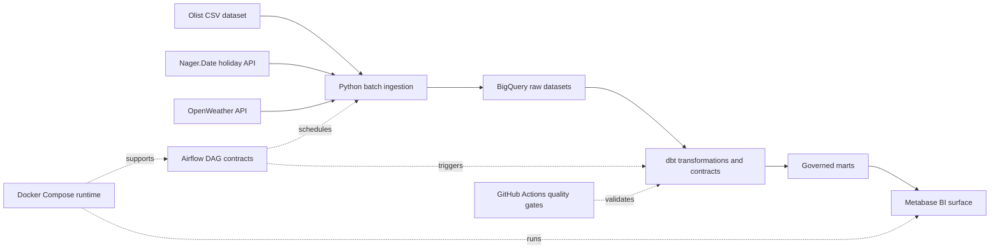

# MerchantPulse: Marketplace Analytics Platform

MerchantPulse is a batch-oriented marketplace analytics platform that loads
transactional and enrichment data into BigQuery, models it with dbt under
explicit data quality contracts, and publishes governed marts for business
intelligence consumption.

The current release delivers the ingestion control plane, warehouse contracts,
Core Trio dashboard package, local Metabase runtime, and GitHub Actions quality
gates needed to operate the platform as a version-controlled analytics product.

## Platform Summary

MerchantPulse is designed for one recurring analytics problem: marketplace
teams need reliable commercial, fulfillment, and seller-performance reporting,
but the source data arrives in multiple shapes and changes on different
cadences.

The platform turns that into one controlled delivery path:

```text
business questions -> ingestion -> warehouse modeling -> data quality
-> marts -> dashboards -> reproducible operations
```

The implementation follows an ELT pattern: data lands in BigQuery first, dbt
applies warehouse-layer contracts, and dashboards read published marts rather
than rebuilding metric logic in the BI layer.

## Release Scope

### Released now

- Python ingestion for Olist transactional data plus holiday and weather
  enrichment
- BigQuery raw, staging, intermediate, conformed, and mart contracts
- dbt tests, source freshness SLAs, snapshots, and dashboard lineage exposures
- Core Trio dashboard package:
  `Executive Overview`, `Seller Operations`, and `Fulfillment Operations`
- Local Metabase runtime with version-controlled SQL assets and reference
  captures
- GitHub Actions split into pull-request quality gates and warehouse-backed
  runtime checks
- Airflow DAG contracts for bootstrap and incremental orchestration

### Planned next

- Published business-intelligence surfaces for
  `mart_customer_experience` and `mart_seller_experience`
- Extended orchestration operating model around the checked-in Airflow DAGs
- Additional warehouse-backed runtime monitoring as environment ownership
  matures

## Architecture And Delivery Flow



Warehouse layering follows a grain-first contract model:

| Layer | Purpose | Contract |
|---|---|---|
| Raw | Preserve source fidelity | Source rows plus `ingested_at_utc`, `source_file_name`, `batch_id` |
| Staging | Standardize shape and types | Rename, cast, normalize, and deduplicate source-shaped records |
| Intermediate | Reusable business logic | Delivery flags, order value, review metrics, seller-day logic |
| Conformed | Shared dimensions and facts | Reusable `dim_*` and `fact_*` models with governed keys |
| Marts | Published KPI tables | BI-facing subject-area contracts with one documented grain per row |

## Published Analytics Surfaces

| Surface | Primary mart | Grain | Primary audience |
|---|---|---|---|
| Executive Overview | `mart_exec_daily` | One row per `calendar_date` | Executives and finance |
| Seller Operations | `mart_seller_performance` | One row per `seller_id`, `calendar_date` | Marketplace operations |
| Fulfillment Operations | `mart_fulfillment_ops` | One row per `purchase_date`, `customer_state`, `delivery_delay_bucket` | Fulfillment operations and analytics |

Reference captures for the current published layouts live under
`dashboards/screenshots/` and are validated against the version-controlled
dashboard specification in `dashboards/specs/core_trio.json`.

## Quality And Operating Model

MerchantPulse treats documentation, tests, and runtime operations as part of
the warehouse contract rather than as follow-on notes.

| Control area | Current implementation |
|---|---|
| Python quality gates | `python tasks.py lint`, `python tasks.py format-check`, `python tasks.py test` |
| dbt structural validation | `dbt deps`, `dbt parse --no-partial-parse`, dashboard asset validation |
| Warehouse-backed runtime checks | Scheduled `dbt source freshness`, `dbt snapshot`, and `dbt test` workflow |
| Dashboard governance | Version-controlled SQL, screenshot evidence, exposures, and spec validation |
| Rerun discipline | Idempotent ingestion plus runbook-defined bootstrap and daily runtime flows |

The pull-request workflow is intentionally secret-free. Warehouse-backed checks
run separately so pull requests stay fast while runtime SLAs and data quality
remain observable in configured environments.

## Quick Start

The standard repository entrypoint is `python tasks.py <command>`. `make`
targets remain available only as thin compatibility wrappers.

1. Create and activate a Python 3.11 virtual environment.
2. Initialize local folders and `.env` template.

```bash
python tasks.py setup
```

3. Install the base dependency set.

```bash
python tasks.py install
```

4. Install orchestration dependencies only if you need the Airflow surface.

```bash
python tasks.py install-orchestration
```

5. Copy `marketplace_analytics_dbt/profiles.yml.example` into your local dbt
   profiles directory and fill environment-backed values.
6. Run the standard repository checks.

```bash
python tasks.py lint
python tasks.py format-check
python tasks.py test
python tasks.py dashboard-validate
```

7. Validate warehouse connectivity and dbt configuration after credentials are
   configured.

```bash
python tasks.py dbt-debug
python tasks.py dbt-build --select mart_exec_daily
```

8. Start the local BI runtime when you need the published dashboard surface.

```bash
python tasks.py metabase-up
python tasks.py metabase-logs
```

## Reader Paths

Use the repository as an entrypoint into the relevant operating document:

| Reader | Start here |
|---|---|
| Architecture reviewer | [docs/architecture.md](docs/architecture.md) |
| Warehouse contract reviewer | [docs/data_contracts.md](docs/data_contracts.md) |
| KPI / semantic reviewer | [docs/metric_definitions.md](docs/metric_definitions.md) |
| Operator | [docs/operations_runbook.md](docs/operations_runbook.md) |
| Dashboard / BI reviewer | [docs/dashboard_specs.md](docs/dashboard_specs.md) |
| Trade-off reviewer | [docs/decisions.md](docs/decisions.md) |

## Repository Layout

```text
ingestion/                    Python ingestion control plane
marketplace_analytics_dbt/    dbt models, tests, snapshots, and exposures
dashboards/                   Dashboard specs, SQL assets, and reference captures
airflow/                      DAG contracts for orchestration
docs/                         Operating and architecture documents
.github/workflows/            Pull-request and runtime quality workflows
tasks.py                      Standard repository command entrypoint
```
