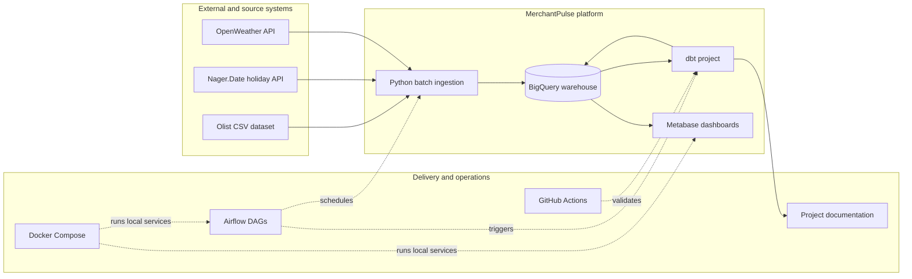
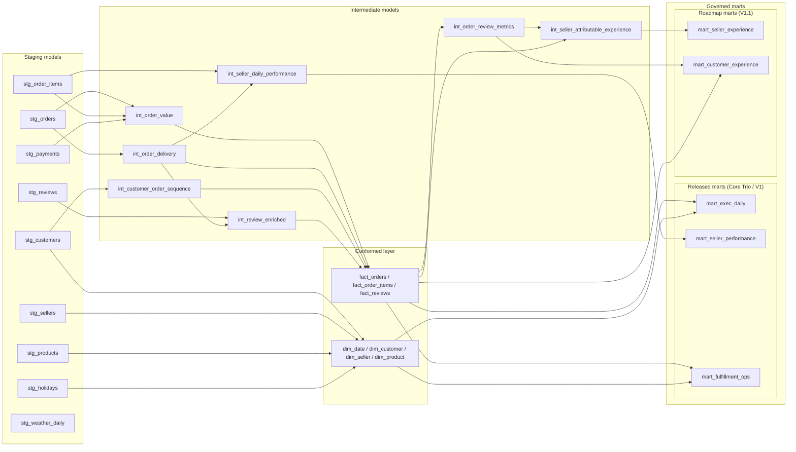
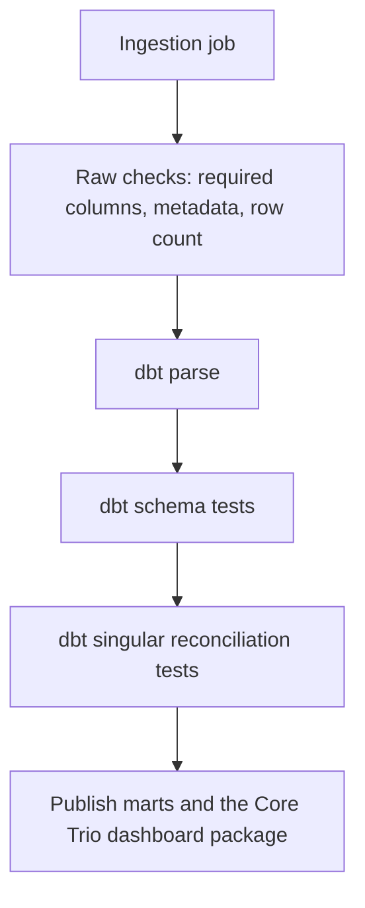

# Architecture: MerchantPulse

This document defines the system boundary, delivery flow, warehouse layering,
and published analytics surfaces for MerchantPulse. It is the primary reference
for understanding how ingestion, BigQuery, dbt, dashboard publication, and
quality gates fit together as one operating platform.

For contract-level details, see `docs/data_contracts.md`. For operator flow and
rerun handling, see `docs/operations_runbook.md`.

## 1. Business Context

| Persona | Needs |
|---|---|
| Executives | Daily revenue, demand, cancellation, delivery, and review health |
| Marketplace operations | Seller commercial health, operational defects, delivery delay patterns, and customer-state operations views |
| Customer experience | Review coverage, review sentiment, time-to-review analysis, and attributable seller experience in the next release |
| Analytics engineers | Documented grains, reusable logic, governed marts, and executable contracts |

## 2. System Context

## 3. Warehouse Layering

| Layer | Target dataset | Responsibility | What does not belong here |
|---|---|---|---|
| Raw | `raw_olist`, `raw_ext` | Preserve source data and batch metadata | Business rules, metric logic, destructive cleanup |
| Staging | `staging` | Rename, cast, normalize, and deduplicate source-shaped records | Cross-source business calculations |
| Intermediate | `intermediate` | Reusable business logic shared across facts and marts | BI-only formatting or duplicate KPI formulas |
| Conformed contracts | `marts` datasets for `dim_*` and `fact_*` models | Reusable dimensions and facts shared across subject areas | Subject-specific KPI rollups or dashboard-only logic |
| Marts | `marts` | Governed subject-area KPI tables for BI consumption | Ad hoc dashboard SQL and inconsistent definitions |

Directory placement in dbt is organizational, not a strict dependency rule.
`dim_*` models are conformed warehouse contracts, so reusing `dim_date` from an
intermediate or fact model is intentional when it prevents duplicate business
definitions.

## 4. Warehouse Model

## 5. Modeling Principles

| Topic | Design choice |
|---|---|
| Pure dimensions | `dim_product`, `dim_seller`, and `dim_customer` publish entity attributes only |
| Conformed dimensions | `dim_*` models are reusable contracts, not single-purpose dashboard tables |
| Canonical customer identity | `dim_customer` grain is `customer_unique_id`, not source `customer_id` |
| Historical customer geography | Facts carry `customer_*_at_order` snapshots so historical orders stay historically accurate |
| Seller and product semantics | `fact_order_items` uses current-state seller/product attributes intentionally; history is available through snapshots |
| Conformed facts | Facts publish governed foreign keys and shared business context once |
| Governed marts | `mart_exec_daily`, `mart_seller_performance`, `mart_seller_experience`, `mart_fulfillment_ops`, and `mart_customer_experience` are the approved BI contracts |
| Dashboard package | The Core Trio release ships Executive Overview, Seller Operations, and Fulfillment Operations as a version-controlled dashboard package; live Metabase publication is an operator step in Metabase OSS |
| Split seller subject areas | Seller commercial/operational metrics and seller experience metrics are separate contracts |
| Split subject areas | Fulfillment operations and customer experience are separate marts to avoid mixed semantics |
| Shared time semantics | Executive, seller, fulfillment, and experience marts cohort by `purchase_date` |
| Shared bucket semantics | `delivery_delay_bucket` is reused everywhere via macro |

## 6. Mart Grain Status

| Model | Release status | Grain | Why |
|---|---|---|---|
| `mart_exec_daily` | Released in Core Trio | One row per `calendar_date` | Canonical executive KPI cohort by purchase date |
| `mart_seller_performance` | Released in Core Trio | One row per `seller_id`, `calendar_date` | Seller-day commercial and operational monitoring on the full seller-order population |
| `mart_fulfillment_ops` | Released in Core Trio | One row per `purchase_date`, `customer_state`, `delivery_delay_bucket` | Order-population operational reporting |
| `mart_seller_experience` | Roadmap for V1.1 | One row per `seller_id`, `calendar_date` | Seller-day attributable review coverage and sentiment on the single-seller subset |
| `mart_customer_experience` | Roadmap for V1.1 | One row per `purchase_date`, `customer_state`, `delivery_delay_bucket` | Review coverage and sentiment reporting |

## 7. Data Quality And Reliability Gates

| Check type | Example |
|---|---|
| Required columns | Raw order data must contain `order_id` and timestamp fields |
| Grain uniqueness | `mart_exec_daily` has one row per `calendar_date` |
| Relationship integrity | Facts must resolve `customer_unique_id`, `seller_id`, `product_id`, and reporting dates correctly |
| Semantic invariant | `delivery_delay_bucket` must match delivery flags and late-day logic |
| Cross-layer alignment | Holiday semantics come from `dim_date` and remain consistent in facts and marts |
| Attribution integrity | Seller experience includes only single-seller orders |
| Reconciliation | Executive, seller, fulfillment, and customer-experience marts reconcile to their upstream facts or reusable intermediates |
| Published-shape contract | BI-facing marts enforce schema with dbt model contracts and the Core Trio dashboards are declared as dbt exposures |
| Runtime operations | Manual warehouse-backed validation can run separately from parse-only CI; freshness is enabled only for runtime feed mode |

## 8. Architecture Principles

- The warehouse is the source of truth for business metrics.
- Dimensions stay pure; facts capture events; marts own published KPI logic.
- `customer_unique_id` is the canonical business-customer key.
- Historical customer geography belongs on facts as order-time snapshots.
- Seller performance and seller experience are separate contracts with separate populations.
- Dashboards read marts and must not rebuild KPI logic.
- The V1 dashboard release is intentionally narrow: commercial signal, seller ownership, and fulfillment root cause come before experience expansion.
- Holiday and delay semantics are shared contracts, not per-model reinventions.
- Ingestion and transformations are idempotent so reruns do not create duplicates.
- Documentation, tests, and SQL must describe the same contract.
