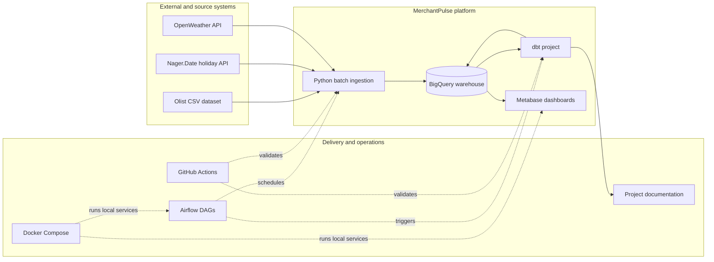
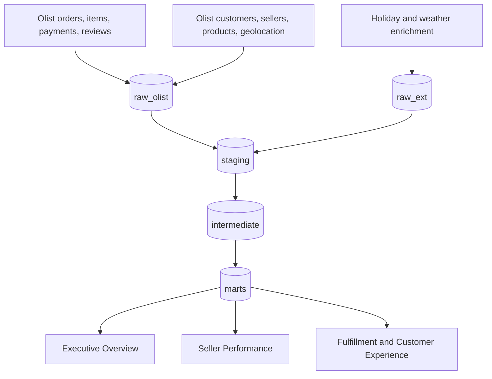
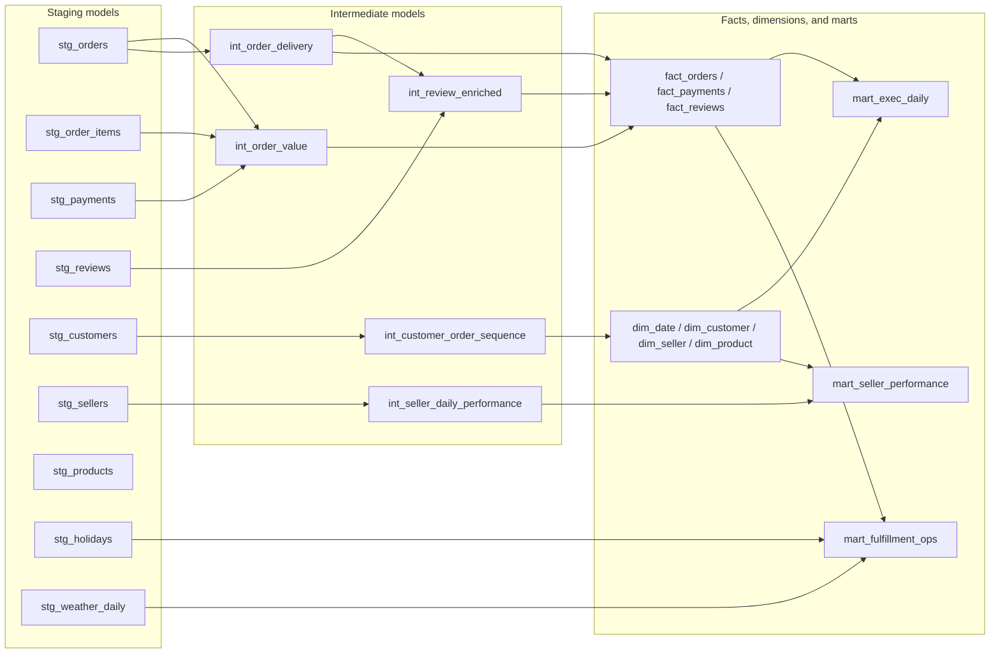
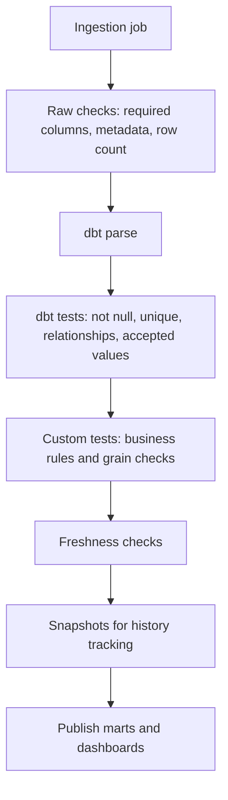
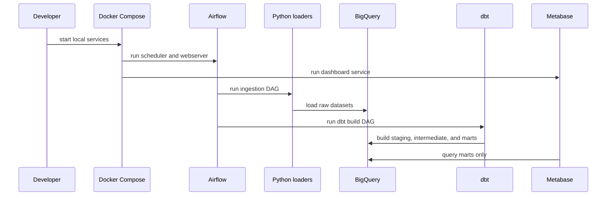

# Architecture: MerchantPulse

MerchantPulse is a target production-style analytics platform for marketplace
revenue and fulfillment reporting. The design follows an ELT pattern: Extract,
Load, Transform. Source data is loaded into BigQuery first, then dbt transforms
it into trusted analytics layers.

This document is intentionally split into current state and target state. That
keeps the portfolio credible while still showing the enterprise-grade design the
project is building toward.

## 1. Current State

| Area | Current repository state |
|---|---|
| Project framing | README and architecture are defined |
| Environment | Dependency files and `.env.example` exist |
| BigQuery | Smoke test exists; datasets and tables are not yet created by code |
| dbt | `marketplace_analytics_dbt` is initialized; no models yet |
| Ingestion | Folder skeleton exists; loaders are not yet implemented |
| Airflow | DAG folder exists; DAGs are not yet implemented |
| Dashboards | Screenshot folder exists; dashboards are not yet built |
| CI | Workflow folder exists; workflows are not yet implemented |

## 2. Business Context

The platform simulates a marketplace business that needs one trusted reporting
layer for revenue, fulfillment, seller quality, customer experience, and
external context such as holidays and weather.

The target consumers are:

| Persona | Needs |
|---|---|
| Executives | Daily revenue, order count, AOV, cancellation rate, late delivery rate, review score |
| Operations | Seller health, regional delay patterns, fulfillment risk, payment failure trends |
| Analytics engineers | Documented sources, grains, model lineage, reusable business logic, tests |

## 3. System Context

## 4. Data Flow

### Layer Responsibilities

| Layer | Target dataset | Responsibility | What does not belong here |
|---|---|---|---|
| Raw | `raw_olist`, `raw_ext` | Preserve source data and batch metadata | Business rules, metric logic, destructive cleanup |
| Staging | `staging` | Rename, cast, deduplicate, normalize timestamps and enums | Cross-source business calculations |
| Intermediate | `intermediate` | Reusable business logic across sources | Dashboard-only formatting |
| Marts | `marts` | Stable business-ready tables with defined grains | One-off dashboard SQL and duplicated KPI formulas |

## 5. Target Warehouse Model

## 6. Data Quality and Reliability Gates

Data quality is treated as a platform feature, not as an afterthought. Core
transaction identifiers must fail fast. Optional enrichment can be missing, but
that missingness should be visible and documented.

### Planned Checks

| Check type | Example |
|---|---|
| Required columns | Raw order data must contain `order_id` and timestamp fields |
| Metadata | Every raw row should include `ingested_at_utc`, `source_file_name`, and `batch_id` |
| Grain uniqueness | `mart_exec_daily` should have one row per `calendar_date` |
| Accepted values | Review score should be between 1 and 5 |
| Relationship integrity | Order items should reference known orders |
| Business rule | Delivered orders should have a delivered timestamp |
| Freshness | Orders and payments target 24-hour freshness; reviews target 48-hour freshness |

## 7. Orchestration and Local Runtime

## 8. Scope

### In Scope for the target version

- Olist marketplace data ingestion
- Public holiday and weather enrichment
- BigQuery raw, staging, intermediate, and marts datasets
- dbt models, tests, source freshness, snapshots, and docs
- Metabase dashboards for executives and operations
- Airflow DAGs for ingestion and dbt execution
- Docker Compose local runtime
- GitHub Actions checks for Python, SQL, dbt, and tests
- Portfolio documentation, architecture images, dashboard screenshots, and interview notes

### Out of Scope for the target version

| Excluded | Reason |
|---|---|
| Streaming ingestion | The source data and analytics use case are batch-oriented |
| Machine learning models | The project is focused on data engineering and analytics engineering |
| Kubernetes | Docker Compose is enough for the local portfolio runtime |
| Multi-tenant access control | The project has one portfolio environment |
| Real production deployment | The target is a reproducible portfolio platform, not a live SaaS system |

## 9. Roadmap by Delivery Phase

```mermaid
flowchart LR
    p1["1. Foundation docs and environment"]
    p2["2. Raw ingestion with batch metadata"]
    p3["3. dbt staging models and source tests"]
    p4["4. Intermediate business logic"]
    p5["5. Facts, dimensions, and marts"]
    p6["6. Freshness, snapshots, and CI"]
    p7["7. Metabase dashboards and screenshots"]
    p8["8. Interview package and resume bullets"]

    p1 --> p2 --> p3 --> p4 --> p5 --> p6 --> p7 --> p8
```

## 10. Architecture Principles

- The warehouse is the source of truth for business metrics.
- Raw data preserves evidence; staging cleans shape; intermediate models hold
  reusable logic; marts serve business users.
- Every fact and mart must document its grain before implementation.
- Dashboards must read marts, not rebuild metric logic.
- Ingestion and transformations should be idempotent, so reruns do not create
  duplicates.
- Core identifiers fail fast; optional enrichment may degrade to null with
  monitoring.
- Documentation should match the current repository state and clearly label
  planned work.
